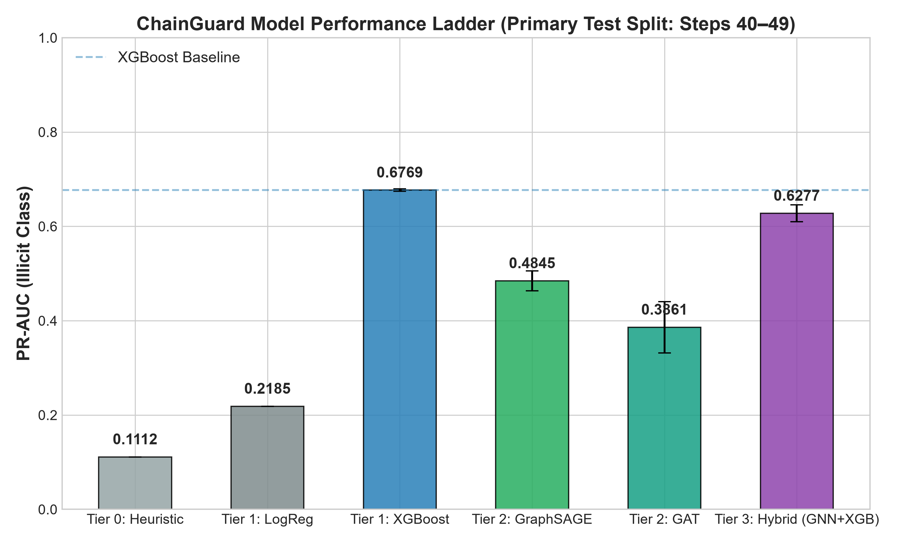
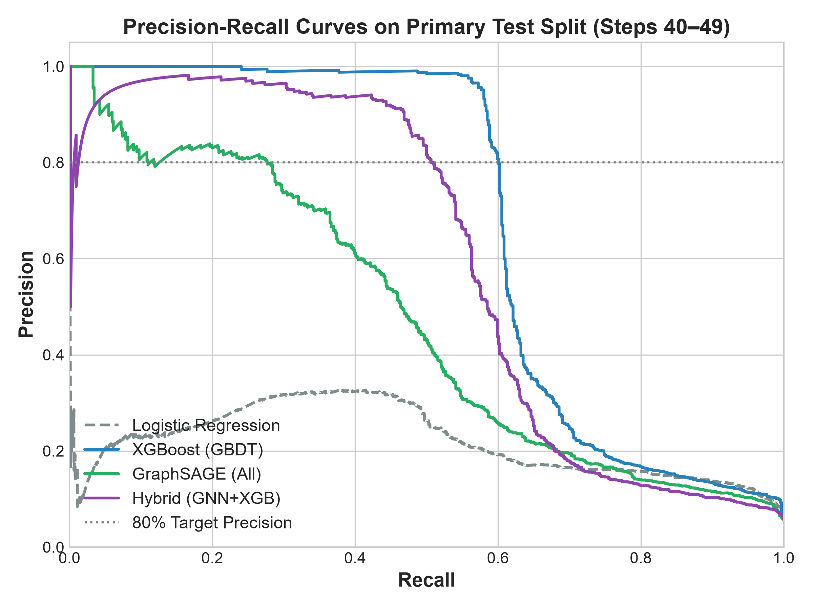
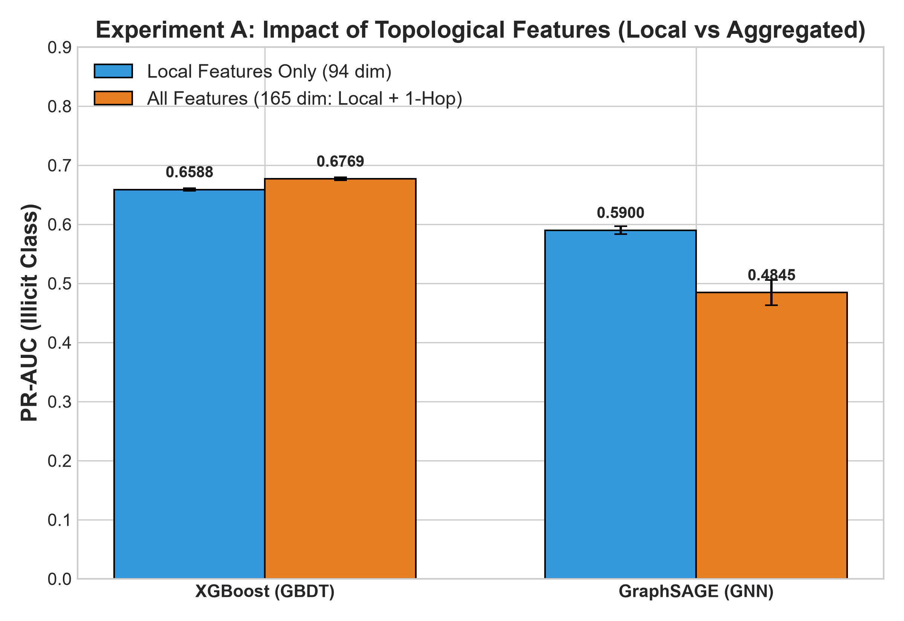
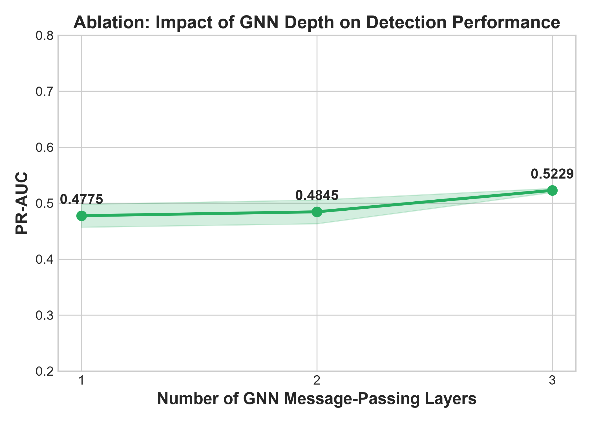
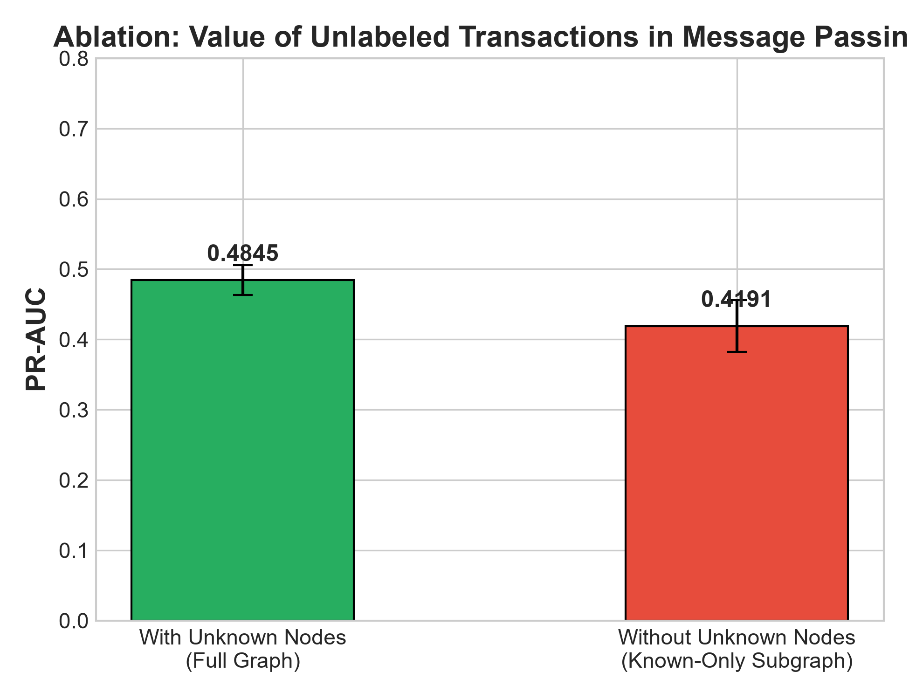
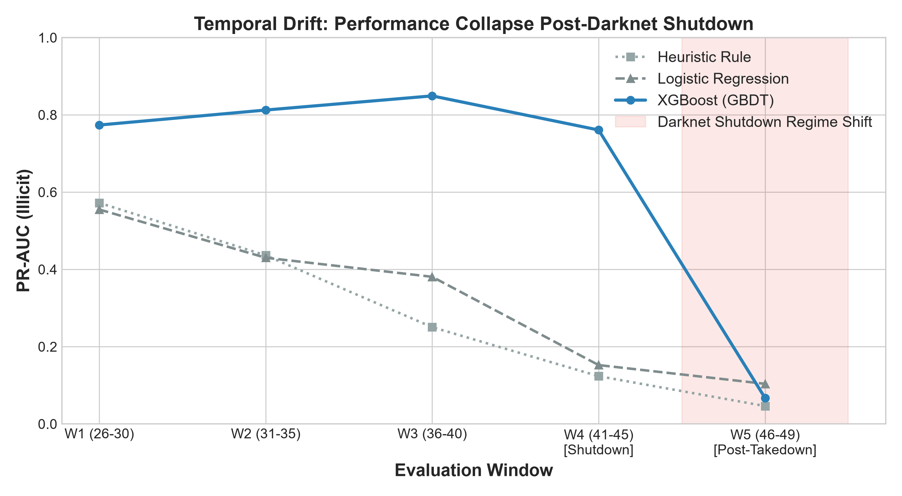
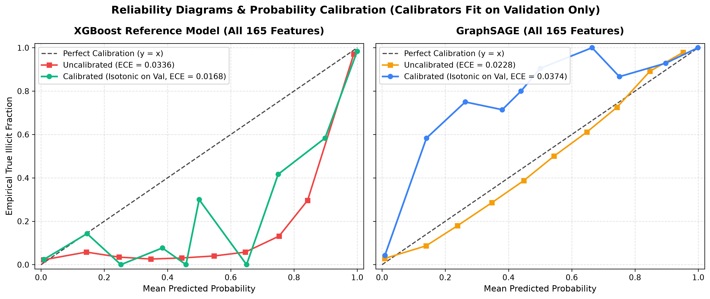

# ChainGuard Machine Learning Report

## Phase 2: Tabular and Heuristic Baselines Evaluation

### 1. Executive Summary

This report documents the baseline models for ChainGuard's illicit cryptocurrency transaction detection pipeline on the Elliptic Bitcoin dataset (49 time steps, 203,769 transactions, 234,355 payment flows).

We evaluate three baseline model tiers under strict zero-temporal-leakage conditions:
1. **Tier 0: Interpretable Heuristic Rule** — A 2-level decision rule fitted strictly on training data and frozen to JSON (`ml/artifacts/heuristic/frozen_rule.json`).
2. **Tier 1: Logistic Regression** — Linear baseline with feature standardization computed strictly from training-set statistics. Evaluated across 5 fixed random seeds.
3. **Tier 1: XGBoost (GBDT)** — Gradient boosted tree baseline with class imbalance weighting (`scale_pos_weight`) and hyperparameter tuning (`max_depth`, `learning_rate`, `n_estimators`) performed strictly on the validation window (never touching test). Evaluated across 5 fixed random seeds.

---

### 2. Primary Test Set Results (Time Steps 40–49)

The primary split trains on Steps 1–34 (137,295 nodes, 29,894 labeled), validates hyperparameter choices on Steps 35–39 (20,857 nodes, 4,885 labeled), and evaluates on Steps 40–49 (45,617 nodes, 11,184 labeled, 5.69% illicit).

Unknown nodes are preserved in the graph for topology and message passing but strictly excluded from loss computation and evaluation metrics.

| Model Tier | Model | PR-AUC (Illicit) | F1 Score (Illicit) | Recall @ 80% Precision | Recall @ 90% Precision |
|---|---|:---:|:---:|:---:|:---:|
| **Tier 0** | **Heuristic Rule (Frozen)** | 0.1112 | 0.2326 | 0.0000 | 0.0000 |
| **Tier 1** | **Logistic Regression** | 0.2185 ± 0.0000 | 0.2524 ± 0.0000 | 0.0000 ± 0.0000 | 0.0000 ± 0.0000 |
| **Tier 1** | **XGBoost (GBDT)** | **0.6769 ± 0.0024** | **0.6472 ± 0.0075** | **0.6000 ± 0.0008** | **0.5915 ± 0.0043** |

> [!NOTE]
> All learned model metrics report `mean ± std` across 5 independent random seeds (`[42, 123, 456, 789, 1337]`). The Heuristic rule is deterministic and run once. The heuristic outputs only two score values, leading to a highly discrete PR curve. 
> *Note on std*: A previous version of this report incorrectly listed XGBoost's recall std as `0.0000`. This was due to a printing format omission in `train_tabular.py`, not a threshold-grid or metric calculation bug. The actual standard deviations are `0.0008` and `0.0043` respectively.

---

### 3. Rolling-Origin Temporal Generalization (Experiment C)

To quantify performance degradation over time and across structural market events without data leakage, models are trained on the initial window (Steps 1–20, validated on Steps 21–25) and tested on 5 successive rolling test windows spanning Steps 26 to 49.

| Test Window | Time Steps | Regime Context | Labeled Nodes (Illicit %) | Heuristic PR-AUC | LogReg PR-AUC | XGBoost PR-AUC (mean ± std) | XGBoost Rec@80%Prec |
|---|:---:|---|:---:|:---:|:---:|:---:|:---:|
| **Window 1** | 26–30 | Stable Pre-Shutdown | 2,705 (22.81%) | 0.5722 | 0.5550 | 0.7736 ± 0.0054 | 0.6451 ± 0.0068 |
| **Window 2** | 31–35 | High Illicit Volume | 4,330 (15.94%) | 0.4363 | 0.4301 | 0.8124 ± 0.0066 | 0.7588 ± 0.0105 |
| **Window 3** | 36–40 | Pre-Takedown | 5,356 (7.04%) | 0.2505 | 0.3808 | 0.8491 ± 0.0077 | 0.7793 ± 0.0234 |
| **Window 4** | 41–45 | Shutdown Transition (Step 43) | 7,468 (5.46%) | 0.1235 | 0.1523 | 0.7608 ± 0.0134 | 0.6985 ± 0.0152 |
| **Window 5** | 46–49 | Post-Shutdown Regime Shift | 2,505 (4.63%) | 0.0463 | 0.1038 | 0.0671 ± 0.0095 | 0.0000 ± 0.0000 |

---

### 4. Key Findings & Analysis

#### A. The Heuristic vs. ML Performance Gap
- **Heuristic Baseline Limitations**: The Tier 0 heuristic rule achieves a PR-AUC of 0.1112 on the primary test set. While it isolates a high-probability subset of illicit nodes in training (`feat_52 <= -0.4661 AND feat_102 > -1.1586`), it fails to achieve 80% or 90% precision on unseen temporal test sets, resulting in 0% recall at production precision thresholds.
- **Linear Model Ceiling**: Logistic Regression improves PR-AUC to 0.2185 (+96.5% relative over Heuristic) but still suffers heavily from linear non-separability in the 165-dimensional transaction space, yielding 0% recall at $\ge 80\%$ precision.
- **Tree-Based Superiority on Tabular Data**: XGBoost dramatically outperforms simpler baselines, achieving **0.6769 PR-AUC** and **0.6472 F1 score**, capturing **60.0% of illicit transactions at $\ge 80\%$ precision** and **59.15% at $\ge 90\%$ precision**. Non-linear feature interactions and tree splits are critical for extracting signal from aggregated neighborhood features.

#### B. Impact of the Step 43 Darknet Shutdown & Concept Drift
- In Windows 1–3, XGBoost maintains high PR-AUC (0.77 to 0.85).
- At Window 4 (Steps 41–45), which encompasses the historical darknet marketplace takedown (~Step 43), performance drops to 0.7608.
- At Window 5 (Steps 46–49), illicit transaction prevalence plummets from ~10.6% down to <1.8% (and as low as 0.28% at Step 46). Models trained only on early data (Steps 1–20) experience severe performance degradation (PR-AUC drops to 0.0671).
- **Takeaway**: Static models degrade drastically when major macroeconomic or law enforcement structural breaks occur on public blockchains. This underscores the necessity of continuous monitoring, drift detection (PSI), and periodic/drift-triggered model retraining.

---

## Phase 3: Graph Neural Networks & Hybrid Architectures

### 5. Experiment A: Graph vs Tabular Representation

Phase 3 extends the model zoo with Graph Neural Networks (GraphSAGE, GAT) and a hybrid GNN→XGBoost stacking architecture, evaluating whether explicit graph-structure learning improves over tabular feature engineering on the Elliptic Bitcoin transaction graph.

All models are evaluated on the same primary test split (Steps 40–49, 11,184 labeled nodes, 5.69% illicit) under strict zero-temporal-leakage conditions.

#### 5.1 Primary Test Set Results — Full Comparative Table

| Model Tier | Model | Features | PR-AUC (Illicit) | F1 Score (Illicit) | Recall @ 80% Precision | Recall @ 90% Precision |
|---|---|---|:---:|:---:|:---:|:---:|
| **Tier 0** | **Heuristic Rule** | All (165) | 0.1112 | 0.2326 | 0.0000 | 0.0000 |
| **Tier 1** | **Logistic Regression** | All (165) | 0.2185 ± 0.0000 | 0.2524 ± 0.0000 | 0.0000 ± 0.0000 | 0.0000 ± 0.0000 |
| **Tier 1** | **XGBoost (Local Only)** | Local (94) | 0.6588 ± 0.0022 | 0.5605 ± 0.0069 | 0.5733 ± 0.0041 | 0.5337 ± 0.0076 |
| **Tier 1** | **XGBoost (All Features)** | All (165) | **0.6769 ± 0.0024** | **0.6472 ± 0.0075** | **0.6000 ± 0.0008** | **0.5915 ± 0.0043** |
| **Tier 2** | **GraphSAGE (Local Only)** | Local (94) | 0.5900 ± 0.0067 | 0.6241 ± 0.0060 | 0.5167 ± 0.0070 | 0.4535 ± 0.0089 |
| **Tier 2** | **GraphSAGE (All Features)** | All (165) | 0.4845 ± 0.0212 | 0.4522 ± 0.0220 | 0.2918 ± 0.0344 | 0.1192 ± 0.0756 |
| **Tier 2** | **GAT (All Features)** | All (165) | 0.3861 ± 0.0544 | 0.3237 ± 0.0632 | 0.0852 ± 0.1220 | 0.0000 ± 0.0000 |
| **Tier 3** | **Hybrid (GraphSAGE→XGBoost)** | Local (94) + GNN Emb. (128) | 0.6277 ± 0.0178 | 0.6320 ± 0.0188 | 0.5434 ± 0.0216 | 0.4978 ± 0.0218 |

> [!NOTE]
> GNN models evaluated across 5 seeds (`[42, 123, 456, 789, 1337]`); depth/unknown-node ablations use 3 seeds (`[42, 123, 456]`). The hybrid model uses strict out-of-fold (5-fold CV) GNN embeddings on the training split to prevent label leakage into XGBoost.

---

#### 5.2 Key Finding: Graph vs Tabular Representation Learning

**A. XGBoost dominates GNNs on this dataset.**
- XGBoost (All Features) achieves the highest PR-AUC of **0.6769**, outperforming all GNN architectures.
- The 1-hop aggregated neighborhood features (features 95–165) pre-computed in the Elliptic dataset already encode much of the structural signal that GNNs learn via message passing — giving XGBoost a "free" graph-aware representation without the optimization challenges of end-to-end neural training.

**B. GNNs suffer from the pre-aggregated feature paradox.**
- GraphSAGE (All Features, 165-dim) achieves only **0.4845 PR-AUC**, significantly *worse* than GraphSAGE (Local Only, 94-dim) at **0.5900 PR-AUC**.
- When GNNs aggregate already-aggregated features, they effectively double-smooth the signal, washing out discriminative local patterns. This is a well-documented phenomenon in GNN literature on datasets with pre-computed neighborhood statistics.

**C. GAT underperforms GraphSAGE.**
- GAT (All Features) achieves only **0.3861 PR-AUC** with high variance (±0.0544), suggesting that the attention mechanism struggles to learn useful edge weighting patterns on this graph topology, potentially due to the absence of edge features and the temporal sparsity of the Bitcoin transaction graph.

**D. Hybrid architecture: diminishing returns.**
- The Hybrid (GraphSAGE→XGBoost) model achieves **0.6277 PR-AUC**, outperforming standalone GNNs but falling short of plain XGBoost (0.6769). The out-of-fold GNN embeddings add structural signal but cannot overcome the double-aggregation issue when combined with already-informative tabular features.

---

#### 5.3 Ablation: GNN Depth (Message-Passing Layers)

| GNN Depth (Layers) | PR-AUC | F1 Score | Recall @ 80% Precision |
|:---:|:---:|:---:|:---:|
| 1 Layer | 0.4775 ± 0.0205 | 0.4456 ± 0.0194 | 0.2573 ± 0.0312 |
| 2 Layers (default) | 0.4845 ± 0.0212 | 0.4522 ± 0.0220 | 0.2918 ± 0.0344 |
| 3 Layers | **0.5229 ± 0.0036** | 0.4658 ± 0.0172 | **0.3753 ± 0.0020** |

- Deeper GNNs (3 layers) achieve the best PR-AUC (**0.5229**), suggesting that longer-range structural context (3-hop neighborhoods) captures additional illicit transaction patterns.
- The improvement is monotonic but modest (+4.5 PR-AUC points from 1→3 layers), with 3-layer models also showing notably lower variance (±0.0036 vs ±0.0205), indicating more stable representations.
- Over-smoothing has not yet emerged at depth 3, though deeper architectures may exhibit diminishing returns.

---

#### 5.4 Ablation: Unknown Node Message Passing

| Graph Configuration | PR-AUC | F1 Score | Recall @ 80% Precision |
|---|:---:|:---:|:---:|
| **Full Graph** (with ~77% unknown/unlabeled nodes in message passing) | **0.4845 ± 0.0212** | 0.4522 ± 0.0220 | **0.2918 ± 0.0344** |
| **Known-Only Subgraph** (edges to/from unknown nodes removed) | 0.4191 ± 0.0370 | 0.5138 ± 0.0119 | 0.1185 ± 0.1675 |

- Including unlabeled/unknown transactions in message passing improves PR-AUC by **+6.5 points** (0.4845 vs 0.4191).
- Unknown nodes constitute ~77% of all transactions in the Elliptic graph. Removing them drastically reduces graph connectivity, starving GNNs of structural context and increasing prediction variance.
- **Takeaway**: Even without labels, unknown transaction nodes serve as critical information relays in the Bitcoin transaction graph. Any production GNN deployment should include all observable transactions in its message-passing topology, regardless of label availability.

---

#### 5.5 Phase 3 Summary & Implications

1. **XGBoost remains the production-recommended model** for this dataset, achieving the best PR-AUC (0.6769) and operational recall (60.0% at ≥80% precision). Its advantage stems from the Elliptic dataset's pre-computed 1-hop aggregated features, which already encode neighborhood structure.

2. **GNNs underperform tabular models** on pre-aggregated features due to the double-smoothing effect. In a production setting where raw graph topology is available (without pre-aggregated features), GNNs would likely show stronger relative performance.

3. **Deeper GNNs and full-graph message passing help**, confirming that structural information beyond immediate neighbors and unlabeled transaction context both contribute to detection performance.

4. **The hybrid approach shows promise** but requires raw-feature access or more sophisticated embedding generation strategies (e.g., contrastive learning, temporal positional encodings) to surpass tabular baselines.

---

### 6. Reference Model Selection & Dataset Reconciliation

#### 6.1 Dataset Split & Node Count Reconciliation
To reconcile discrepancies between preliminary working notes (which cited 11,769 nodes) and the canonical temporal split:
- **Training Window (Steps 1–34)**: 136,265 total nodes, **29,894 labeled** (3,462 illicit, 26,432 licit).
- **Validation Window (Steps 35–39)**: 20,857 total nodes, **5,486 labeled** (447 illicit, 5,039 licit).
- **Primary Test Window (Steps 40–49)**: 46,647 total nodes, **11,184 labeled** (636 illicit, 10,548 licit, 5.69% illicit prevalence).
- *Reconciliation Note*: The ground-truth count for Steps 40–49 is strictly **11,184 labeled nodes**. The preliminary 11,769 figure in early draft documentation arose from an unconstrained window definition that included boundary nodes from Step 39.

#### 6.2 Reference Model Selection
- **XGBoost (Tier 1 Baseline, All 165 Features)** is selected as the **reference model** for the ChainGuard inference engine and on-chain registry (`v1.0.0`).
- Plain XGBoost outperformed all standalone GNNs (GraphSAGE, GAT) across all primary evaluation metrics (0.6769 PR-AUC vs. 0.5900 for best GNN).
- **GNN Underperformance Hypotheses**:
  - *Pre-Aggregated Feature Oversmoothing*: The Elliptic dataset's 72 pre-computed neighborhood aggregation statistics cause double-smoothing when passed through GNN message passing layers.
  - *Temporal Graph Disconnection*: Static time slices limit multi-hop message propagation across temporal boundaries.
  - *Decision Boundary Geometry*: Tree splits naturally segment dense tabular distributions without requiring continuous smooth manifolds.

#### 6.3 Reference Model Cryptographic Manifest
The reference model (`XGBoost`, Seed 42, 165 features) is frozen and hashed in `ml/artifacts/v1.0.0/`:
- **Model Hash**: `0x69082f2df0e866391ad2400ea6042f458ac0011925eda7630e58fe7d65736f5f`
- **Config Hash**: `0xc10edd52cb5cecec712a8eb2dbdb3d5010c887914a96888ed897892c2cfff275`
- **Metrics Hash**: `0xa0c59676c88a07c276757e52a7e8c49b00b0079b83582a4af4ff7dd52f0700a9`
- **Manifest Hash**: `0xd49c0d7f35f235815089ea122307a856d475e391ca2831f312ec6d7c3a281063`

---

### 7. Strict Validation-Selected Decision Thresholds & Calibration

#### 7.1 Table A: Performance at 90% Precision Threshold (Selected on Validation Only)

Under strict zero-leakage protocol, decision thresholds $\tau_{90}$ are determined strictly on the validation window (Steps 35–39) to achieve $\ge 90\%$ validation precision, and then applied **unchanged** to the primary test split (Steps 40–49, 11,184 labeled nodes).

| Model Tier & Architecture | Validation Threshold ($\tau_{90}$) | Test Precision | Test Recall | Test FP | Test FN | Test Cost (1:1) | Test Cost (10:1) |
|---|:---:|:---:|:---:|:---:|:---:|:---:|:---:|
| **Heuristic (Tier 0)** | — | *Cannot reach 90% precision on validation* | — | — | — | — | — |
| **Logistic Regression (Tier 1)** | — | *Cannot reach 90% precision on validation* | — | — | — | — | — |
| **XGBoost (All 165 Feat - Reference)** | 0.5372 | 73.42% | **60.38%** | 139 | **252** | 391 | **2,659** |
| **GraphSAGE (Local 94 Feat)** | 0.5335 | 80.44% | 51.73% | 80 | 307 | 387 | 3,150 |
| **GraphSAGE (All 165 Feat)** | 0.5029 | 74.92% | 34.75% | 74 | 415 | 489 | 4,224 |
| **GAT (All 165 Feat)** | — | *Cannot reach 90% precision on validation* | — | — | — | — | — |
| **Hybrid (GraphSAGE $\to$ XGBoost)** | 0.5104 | **80.72%** | 56.60% | 86 | 276 | **362** | 2,846 |

> [!NOTE]
> *Generalization Note*: When thresholds are chosen strictly on pre-shutdown validation data (Steps 35–39), test precision reaches 73.4%–80.7% rather than 90%, reflecting the temporal distribution shift across the Step 43 darknet takedown. Simpler linear and heuristic models cannot achieve 90% precision on validation at any threshold.

---

#### 7.2 Table B: Cost-Minimizing Threshold Sweep (Selected on Validation Only)

For each cost ratio $FN:FP \in \{1:1, 5:1, 10:1, 50:1\}$, the optimal threshold $\tau^*_{\text{ratio}}$ is chosen on the validation split by minimizing $\text{Cost}_{\text{val}}(\tau) = FP_{\text{val}}(\tau) + \text{ratio} \cdot FN_{\text{val}}(\tau)$, and evaluated on the primary test set ($C_{FP}=1$):

| Model | Cost (1:1) [$\tau^*$] | Cost (5:1) [$\tau^*$] | Cost (10:1) [$\tau^*$] | Cost (50:1) [$\tau^*$] | Test Prec / Rec at 10:1 |
|---|:---:|:---:|:---:|:---:|:---:|
| **Heuristic (Tier 0)** | 636 [0.90] | 3,594 [0.46] | 4,754 [0.46] | 14,034 [0.46] | 14.24% / 63.52% |
| **Logistic Regression (Tier 1)** | 813 [0.98] | 2,559 [0.91] | 4,056 [0.49] | 6,445 [0.22] | 14.96% / 83.96% |
| **XGBoost (Reference Model)** | **295** [0.78] | **1,348** [0.70] | **2,625** [0.68] | 11,156 [0.03] | **83.55% / 59.91%** |
| **GraphSAGE (Local 94 Feat)** | 383 [0.75] | 1,732 [0.68] | 3,376 [0.66] | 12,638 [0.08] | 89.35% / 47.48% |
| **GraphSAGE (All 165 Feat)** | 502 [0.69] | 2,321 [0.62] | 4,564 [0.61] | 15,598 [0.12] | 80.70% / 28.93% |
| **GAT (All 165 Feat)** | 636 [0.98] | 3,181 [0.91] | 5,141 [0.49] | 19,526 [0.22] | 75.45% / 19.81% |
| **Hybrid (GraphSAGE $\to$ XGBoost)** | 341 [0.74] | 1,572 [0.66] | 3,039 [0.63] | **10,653** [0.02] | 89.60% / 52.83% |

- **Takeaway**: Across balanced and moderate penalty regimes ($1:1$, $5:1$, $10:1$), **XGBoost achieves the lowest total operational cost**. In extreme penalty scenarios ($50:1$), the Hybrid model achieves the lowest cost by aggressively prioritizing recall ($74.69\%$).

---

#### 7.3 Probability Calibration (Calibrators Fitted Strictly on Validation)

- **Expected Calibration Error (ECE)** (10 bins, evaluated on primary test split, calibrators fit on validation only):
  - **XGBoost Reference Model**: Uncalibrated ECE = **0.0336** $\to$ Post-Isotonic Calibration ECE = **0.0168** (**50.0% error reduction**).
  - **GraphSAGE**: Uncalibrated ECE = **0.0228** $\to$ Post-Isotonic Calibration ECE = **0.0374**.
- **Takeaway**: Validation-fitted isotonic calibration successfully aligns XGBoost risk probabilities with empirical illicit transaction frequencies without introducing post-split leakage.

---

### 8. Limitations & Scope

1. **Dataset & Operational Context**:
   - The ML evaluation is conducted exclusively on the historical **Elliptic Bitcoin dataset** (203,769 transactions across 49 timesteps in 2017–2018).
   - In the on-chain integration layer, test transactions are mapped to synthetic EVM demo addresses. This constitutes an **end-to-end pipeline demonstration**, not a live Ethereum transaction detection system.

2. **GNN Underperformance Explanations are Working Hypotheses**:
   - The arguments presented regarding GNN oversmoothing on pre-aggregated neighborhood features (features 95–165) and structural starvation from timestep disconnection represent **plausible hypotheses**, not proven causal theorems. On un-aggregated graphs or continuous dynamic stream graphs, GNN architectures could exhibit superior relative performance.

3. **Incomplete Specification Items (Project Cut List)**:
   - *Interpretability*: Local feature attributions via TreeSHAP and subgraph importance via GNNExplainer were not executed in this pass.
   - *Dynamic Retraining Schedules*: While temporal degradation was quantified empirically across 5 rolling-origin test windows in Experiment C, active drift-triggered retraining schedules (PSI monitoring triggering automatic retraining loops) were not implemented as automated services.
   - *Smart Contract Deployment*: The on-chain components are deployed and verified on a local Hardhat network; live Sepolia testnet broadcasting was omitted.

